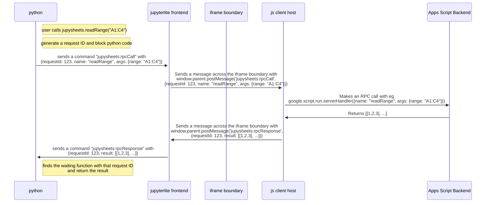

# Jupysheets - jupyterlite in google sheets

The vision is jupyterlite running in google sheets sidebar,
allowing for reading, modifying, and writing sheet data with your favorite
python tools such as polars.

This isn't working yet, but I have prototypes for several of the necessary parts of
communication.

I can pass a message from the python kernel all the way out to the js client host.
The tricky thing I'm running into now is that jupyterlab uses a messaging paradigm,
not call and response, so while I can send a message from python out to js,
I haven't yet figured out how to get a message back.

This isn't quite what is happening currently, but large scale this is the idea:

## Dependencies and Related Work
- https://github.com/jtpio/ipylab: a jupyterlab extension that enables the two-way communication
of arbitrary commands from the python kernel back and forth to the jupyterlab frontend.